## An Island of Foxes

On the 20th of May 2016, I embarked on a journey to an island off the coast of Southern California. Unbeknownst to many people, our Golden State has 8 Channel Islands which each have something unique to offer. While most people are familiar with Catalina Island and its wild Bison, zip lining adventures, underwater snorkeling, and parasailing attractions, there are also the Islands of Anacapa, Santa Rosa, San Miguel, and Santa Cruz, to name a few. Unlike Catalina, people do not inhabit any of these other islands. They are home to some of he most magnificent national parks where indigenous animals roam wild and free. Having visited Catalina before, I spun the wheel (so to speak), and it landed on Santa Cruz Island. So, that's where I was heading to. Island Packers Cruises was the transport boat. As we embarked from Ventura Harbor, the ocean was anything but calm. 

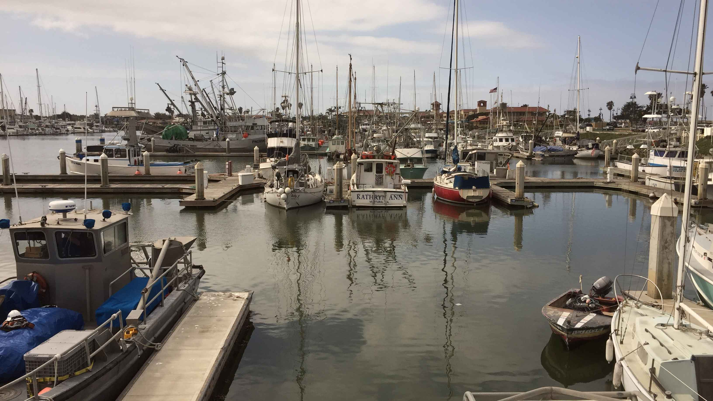

I braced myself and relied on the motion sickness pills I took moments earlier to get me through the bumpy water ride. 

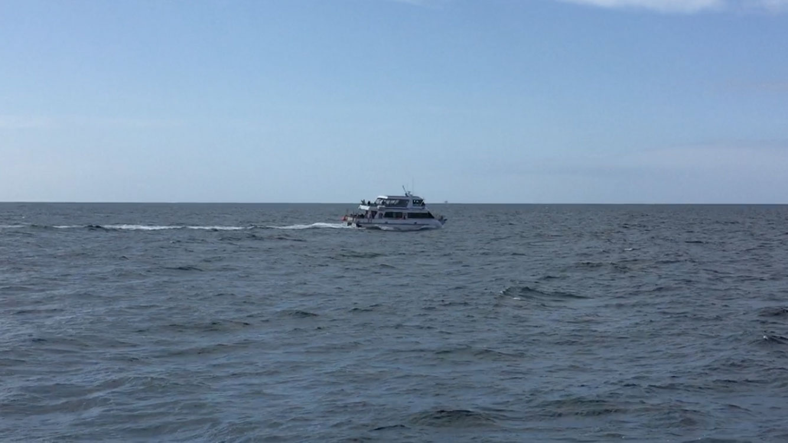

The view was majestic, nonetheless, and the ocean mist with a nice accompanying breeze was breathtaking, to say the least. One hour later, we had arrived; but, because the pier had been partially destroyed by island storms, we were taken to shore on skiff boats. 

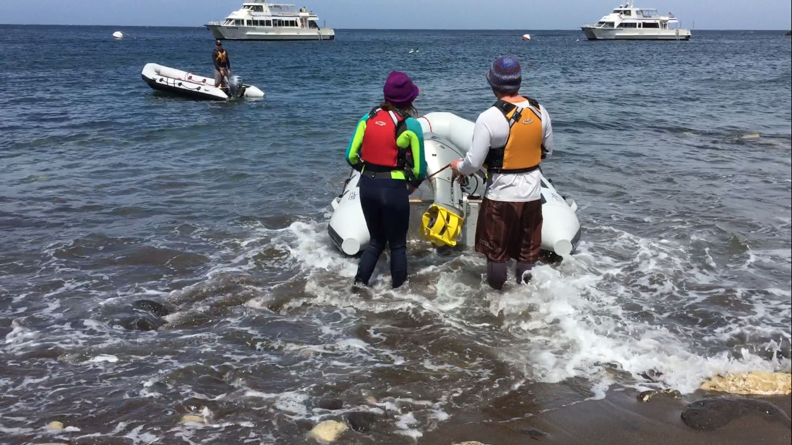

It was something unreal, like a scene from the movie Charlie's Angels.

As we landed ashore, we were greeted by the Park Ranger who had briefed us on safety, and gave us some sightseeing  pointers. We began to make our way through the rocky terrain, but soon enough our feet would feel the cushion of the sandy turf ahead. 

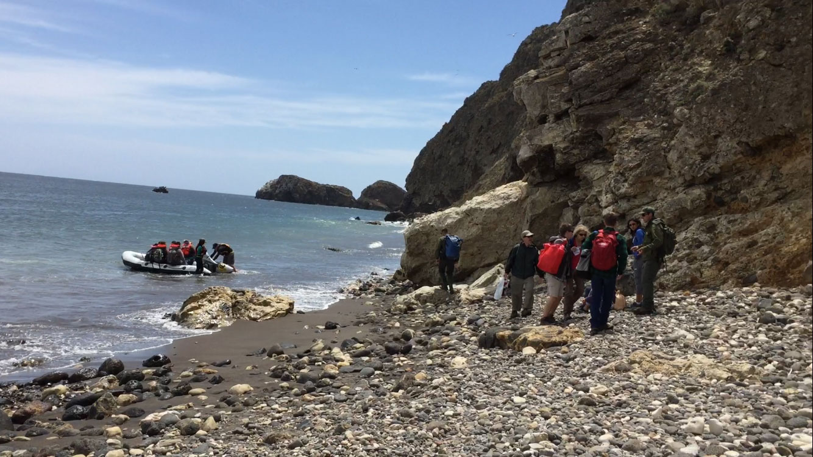

Right in front of us were remnants of a lost civilization. California has a rich Native American History which dates back tens of thousands of years, but I'm talking about a more recent history going back only about 90 years. What was in front of us was a ranch formerly inhabited by Italian Immigrants; a ranch where they raised sheep, pigs, farmed, and produced a unique brand of wine for the mainland of Southern California. 

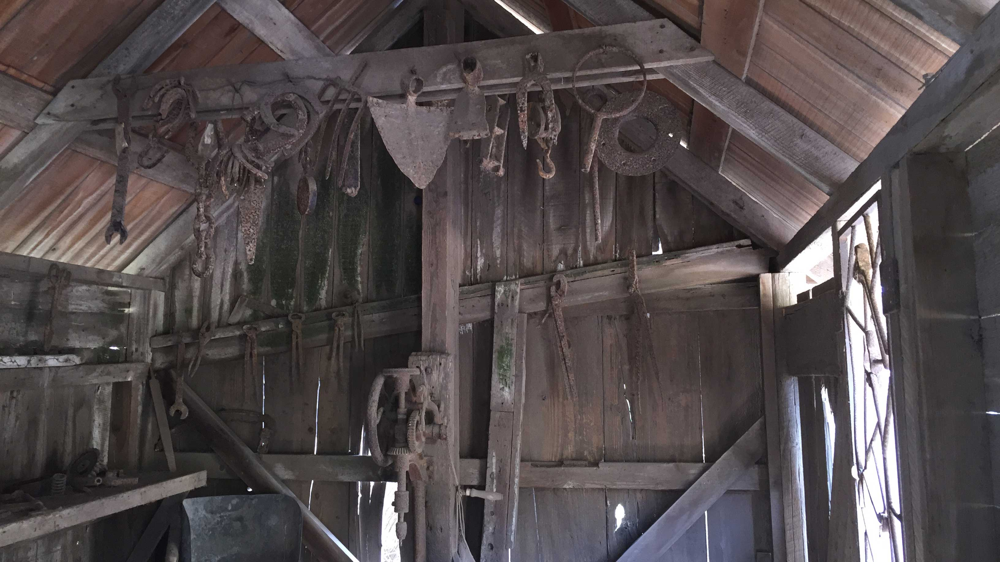
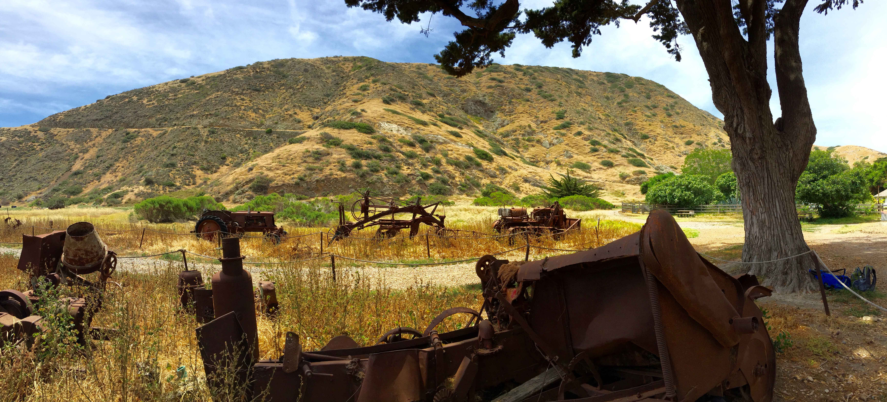

The island is rich in many different species of flora, fauna, plants, and land mammals that do not exist anywhere else; for example, the island fox. Unlike any other species of fox, this little rascal is about the size of a young puppy dog; it is completely harmless, and friendly. 

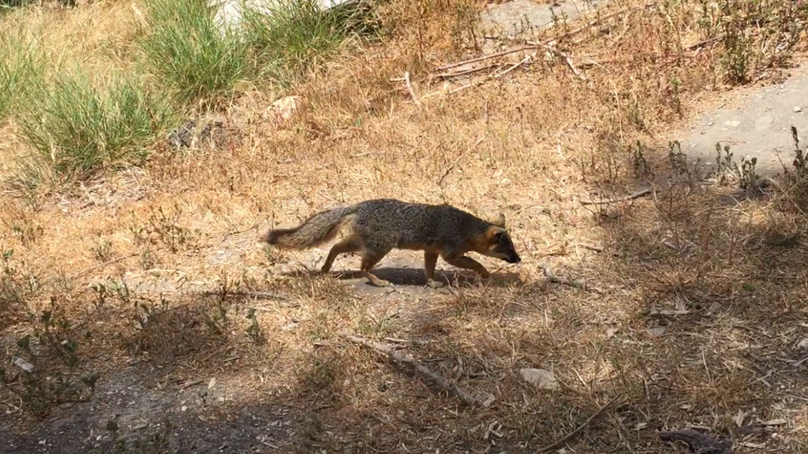

As I hiked up Scorpion Canyon, there was nothing but open brush blending into the background of acres and acres of hills. It is said that this land came about as a result of volcanic activity. As I walked through this luscious valley, I could hear the silence of nature - birds chirping, and the foxtails singing their own unique music to the tune of the wind. 

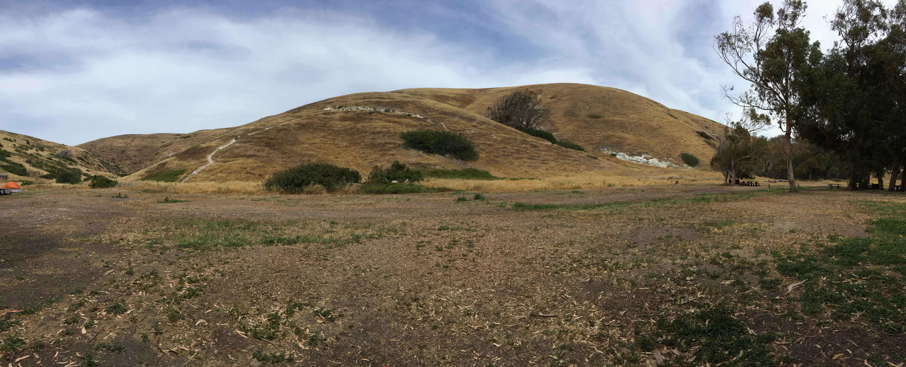

This was absolute tranquility. A breeze blew over my shoulders, and hinted to me with its breath, as if but a whisper would say... 

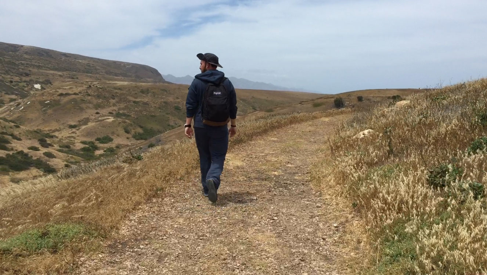

"the earth is your mother, press on..."  

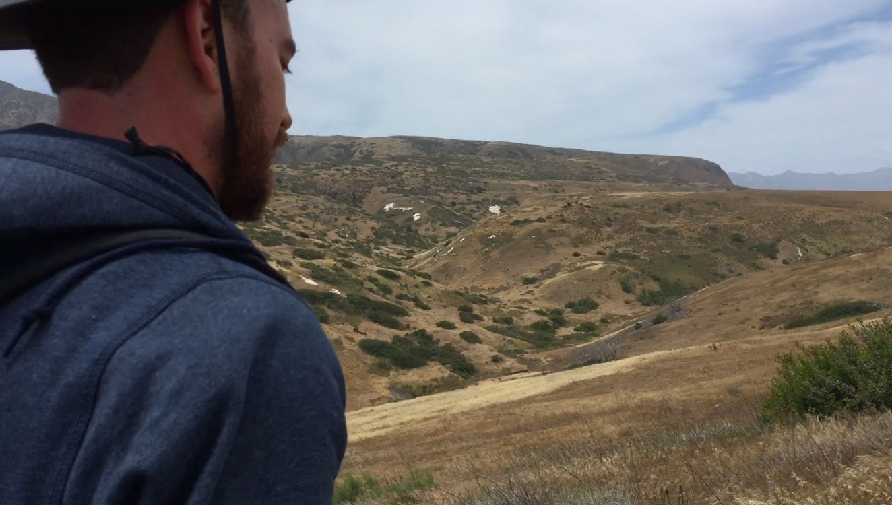

As I reached the top of Cavern Point, the ocean revealed itself once more, but from a far greater height, and with a much grander view. This is paradise. This is heaven on earth.

My imagination began to take me to people and placed like this one, never seen before, but visited in spirit, to centuries past. The natives too once stood here and looked out into the horizon. What did they dream about? Though their civilization is now lost, it is not fogotten, and the land is very much alive. You just have to look deeper. The spirit of Santa Cruz Island is forever embedded in the landscape. 

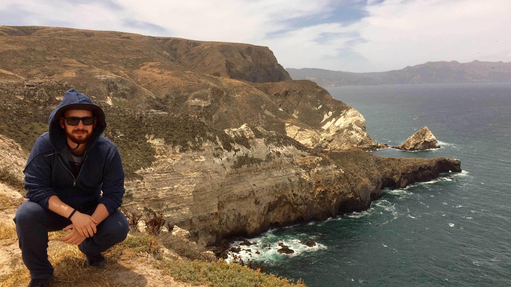

<!-- blank line -->
<iframe width="100%" height="700px" src="https://www.youtube.com/embed/uF97b-YwfUA" frameborder="0" allow="accelerometer; autoplay; encrypted-media; gyroscope; picture-in-picture" allowfullscreen></iframe>
<!-- blank line -->
