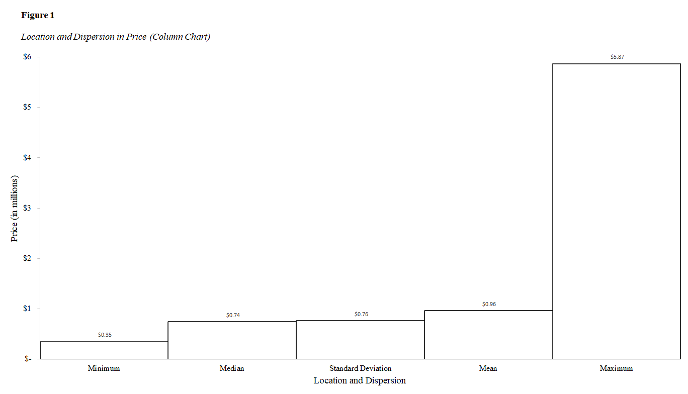
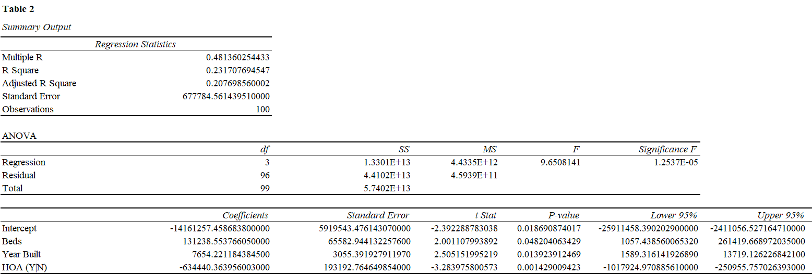

## **Abstract**

Real-estate market dynamics in Los Angeles County affect the decision-making
framework of all stakeholders involved in the buying or selling process. For first time home
buyers and realtors alike looking to expand their market reach, the methodologies presented in
this paper add value in this endeavor. Leveraging exploratory data analysis lends itself to
comparative metrics between prices and home characteristics not limited to size and year built
and expanding into specific characteristics that portray relationships between all variables of
interest. To establish and understand these key performance indicators (KPIs) from a selective
sample, a reproducible, excel-based model is produced. Limitations are discussed based on the
sample size and suggestions are made for further refinement utilizing other sampling
methodologies and software packages.

## **Real Estate Prices in Los Angeles – A Case Study from Redfin**

There are several stakeholders involved in the real-estate decision-making framework. Real-estate corporations and individual decision makers alike are often tasked with resolving where and what to buy as they partake in their search for single family housing properties. However, one must choose an area of focus, especially as a future home buyer. This carefully selected dataset was chosen for a specific geographic region of the Los Angeles County in Southern California. The data is sourced from Redfin as opposed to other real-estate resources due to its ease of public access for MLS (Multiple Listing Service) properties. This dataset is represented by a flat .csv file which has been downloaded at a static moment in time in September 14, 2020; nonetheless, contained herein are all of the relevant parameters in helping to establish trends in the Los Angeles Housing Market. These parameters serve to identify patterns between price, housing type, and location, to name a few variables of interest. Considerations are made for the sample size, as the first 100 listings are examined, thereby extracting an appropriate sample for the ensuing analysis. Establishing pricing patterns by location and disposition of home will be of great benefit to the stakeholders involved. 
For example, a realtor might leverage this analysis to target specific zip codes with higher mean home prices. This action could potentially benefit the realtor visa vie an increase in commission from sales. The consumer, on the other hand, may trade neighborhood (zip code) for affordability. One such variable versus another only sheds light on a particular relationship. For this reason, additional variables need to be considered. Furthermore, one may look at the year that a house was built as a strategic advantage or disadvantage. This paper aims to examine these independent (predictor) variables against the dependent variable of price. In so doing, if a strong correlation exists, the model can prove to be beneficial and hold merit. 
ng, if a strong correlation exists, the model can prove to be beneficial and hold merit. 

A similar study has been conducted where “home values vary across neighborhoods. This implies that certain neighborhood characteristics are more desirable than others” (Hipp & Singh, 2014, pg. 254). The goal of the research was to determine if there was a relationship between “New Urbanism—population density, older homes, a lack of concentration of single family units”( Hipp & Singh, 2014, pg. 254). Additionally, the research examined the Playa Vista Community, attributing revitalization to new infrastructure and addition of important technological companies like Youtube, Microsoft, and Fox Sports (Hipp & Singh, 2014, pg. 258). Moreover, this study incorporated a similar dependent variable of home price (Hipp & Singh, 2014, pg. 260). In a comparable study, analysts establish “how the housing market will function in the post housing market bubble decade. It is a useful time to take another look at how the housing market behaves and what underpins housing prices” (Clark, 2011, pg. 1).

## **Exploratory Data Analysis**

As shown in Figure 1, location and dispersion confirms that certain disparities exist.

**Figure 1.**

*Location and Dispersion in Price (Column Chart)*

**Note.** Prices are reflected in millions and show five of the most important summary statistics.

The median house price is 742,450, while the minimum housing price is 350,000. The average house price is 946,246.46. Since such a large range between data points in price exists, other variables of interest will be examined to establish relationships as they arise.
As shown in Figure 2, a strong linear relationship does not exist between year built and price. There are a few noticeable outliers that create somewhat of a resemblance to a positive correlation. However, such a pattern cannot be recognized mathematically.  Most of the data points are scattered around the one-million-dollar price mark, and do not show a significant relationship between that the house was built and its resulting price.

**Figure 2.**

*Year Built vs. Price*

*Note.* The year built is loosely correlated with price, offering no significant association.  

Moreover, as shown in Figure 3, the relationship between days on market and price is stronger, suggesting a better linear relationship and positive correlation. An increase in the number of days on the market, shows a corresponding increase in price.

**Figure 3.**

*Days on Market vs. Price*

*Note.* Days on market has a more substantial positive relationship with price.

## **Generalized Linear Model (GLM)**

$$
\begin{align*}
Price~(in~USD)=\beta_0 + \beta_1Year\_Built\begin{pmatrix}
    1 = (1911 - 1932)\\
    2 = (1933 - 1954)\\
    3 = (1955 - 1976)\\
    4 = (1977 - 1998)\\
    5 = (1999 - 2020)
  \end{pmatrix} +\beta_2Bedrooms\begin{pmatrix}
    1 = (1911 - 1932)\\
    2 = (1933 - 1954)\\
    3 = (1955 - 1976)\\
    4 = (1977 - 1998)\\
    5 = (1999 - 2020)
  \end{pmatrix}
\\
\\+\beta_3HOA(Y|N) +\beta_4Region\_in\_LA\_County\begin{pmatrix}
    1 = Antelope~Valley\\
    2 = Los~Angeles~County\\
    3 = San~Fernando~Valley\\
              .\\
              .\\
              .\\
    10 = West~Los~Angeles
  \end{pmatrix}
\\
\\+\beta_5Housing\_Type\begin{pmatrix}
    1 = SingleFamily\\
    2 = Townhouse\\
    3 = Condo/Co-op\\
    4 = Multi-Family\\
    \end{pmatrix} + \epsilon
\end{align*}
$$
where $\small\ Price$ is the variable of interest (the dependent variable); 
<ol> Independent variables: $\small\ Year\_Built, \small\ Bedrooms, \small\ Region\_in\_LA\_County, \small\ Housing\_Type$ 
 $\beta_0$ is the intercept, or constant offset term; 
$\beta_{(1~to~i)}$ is the regression coefficient; and 

$\epsilon$ is the error factor associated with each regression coefficient.</ol>

 

In this generalized linear model (GLM), the variable of interest is Price (in $USD). It is the
variable (*y*) that is dependent on the following independent variables (*x*) ranked in descending
order of impact. Year_Built has a higher positive correlation on selling price as newer homes are
“selling at higher prices than those that were built in the past” (Manausa, 2012). Lastly, the
Region_in _LA_County is of a more categorical nature; thus, while this does illustrate price
dynamics by market location, examining this data last fits the model more appropriately.

 

Table 1 represents the characteristics by housing type (Single Family, Townhouse,
Condo/Co-op, and Multi-Family) for the sample population (n = 100).

 

48 of these 100 homes sampled from the redfin dataset are single family. 10 of them are town homes. 38 are condo/coops, and 4 are multi-family housing units. Of the 100 sampled herein, 13% of these homes were
built between the years of 1911-1932. 15% were built between 1933-1954. 19% were built
between 1955-1976. However, more than half of these homes (53%) were built between 1977-
2020. Notwithstanding, an interesting characteristic to note is that of single-family homes, where
most of these properties (31%) were constructed between 1933-1954. The original dataset
contains the specific year as it pertains to each row; however, these years were bucketed for the
sake of a more standardized model. 

The most common number of bedrooms are 2 (31% of the dataset). 46% of single-family
homes are known to have 3 bedrooms. 50% of the 10 town homes in this sample have 2
bedrooms. What stands out the most in the “Bedrooms” variable is that 75% of the multi-family
homes sampled have 4 or more bedrooms. This is proportional to the scale (size) of the housing
unit.

The data also examines whether each housing type has an HOA or not. 56% of the
properties sampled do have an HOA, whereas 44% do not. This would suggest, at least on a high
level, that most of the properties are condominiums and/or town-homes. However, upon closer
examination, this is not the case. The dataset presents an equal number of condominiums and
town-homes (*n* = 48) as single-family homes. The 19% visibility of homeowner’s associations in
single family homes contributes to the spike of HOA prevalence across this sample.
Furthermore, Los Angeles County presents a wide range of observable data, with 50 cities
(accounting for half of the observable records) in this dataset. Shifting the focus from city to
region produced ten meaningful areas of focus. Whereas Antelope Valley and South Los Angeles
showed no material (not statistical) significance, that 10% of all town homes in this sample are
sold there. 30% of this type of home exists in this sample for the San Fernando Valley (the
region selling that sells the highest percent of this type of home in the sample). Moreover,50% of
the data exists in the city of Los Angeles, San Fernando Valley, and Santa Clarita, which account
for 30% of all regions represented here. Los Angeles (city of) accounts for 22%, San Fernando
Valley - 18%, and Santa Clarita - 10%, respectively. South/ Southeast Los Angeles, West Los
Angeles (and West Hollywood), as well as the Antelope Valley comprise the remaining 50% of
all housing units represented in this sample. 75% of all multi-family housing units exist in the
city of Los Angeles proper. This table shows statistical significance between the variables of
interest and housing type at an α level of .05 (*P* <.0001).

## **Limitations**

In order to yield a net benefit visa vie reproducibility in subsequent iterations of the
methodologies described herein, the limitations pertaining to this dataset warrant further
examination to mitigate against pitfalls in further repeat studies of a similar magnitude. To
accomplish this task, we must first discuss these limitations in terms of accuracy versus
precision. The data was sourced as a static .csv file on the fourteenth of September 2020,
assuring precision through this date only. Its accuracy cannot be fully guaranteed for the
following reasons. Real estate data changes in real time, as houses are bought and sold. Thus, a
more refined model should take the same data into account, but not through a static .csv file. For
example, statistical packages and libraries in R Studio (i.e., read .csv, readr, etc.) are capable of
loading this data repeatedly over the course of a few weeks while establishing summary
statistics, but with the added bonus of tracking variances in results as the housing market
changes.

Furthermore, redfin.com, while rich in location-based housing information nationwide,
does not lend itself to the best exporting capabilities to meet the needs of full size and scope for
any given market. Consequently, there exists “a 350 home cap on data downloading” (Murphy,
n.d.). Thus, restricting the dataset to a sample size of the first n = 100 rows of data without a
proper randomization technique, creates yet another challenge in data integrity. To obtain a
sample that is more representative of the population as a whole, a simple random sample would
suffice. Here, the researcher could open the .csv file, save it as an .xslx file to keep the formulas,
and create a new column (A) and fill the cells down in ascending order (0,1,2,3…350). The
adjacent column (B) could contain a formula =RANDBETWEEN($A$2,$A$352) where each
cell contains a value between the top and bottom cell in the dataset. Filtering the new column
down to values zero to one hundred will yield the desired results. 

Lastly, creating a significant model for home prices in Los Angeles County based on
limited information at only one moment in time presents the bottleneck of bucketing or
classifying the many cities within Los Angeles County. Out of these 100 observations, the report
yielded 50 unique cities, which would be unsustainable for a linear regression model. Initially,
ten cities with the highest average home price were chosen with the intent of illuminating
insights on the composition of home prices across the county of Los Angeles. However, to
mitigate against any potential bias resulting from this sample, a better methodology was
produced, where the cities were bucketed into twelve geographic regions. This was further
refined and the geographic regions were narrowed down to ten categories for a concise, yet,
more robust and accurate model. 

## **Regression Analysis of Project Data**

Figure 4 shows a summary output table using Microsoft Excel’s data analysis toolpak. In further refining and assessing the model, three of the independent variables are incorporated into a more robust framework, thereby commencing in a multiple regression table from which we are able to draw inference from.

**Figure 4.**

*Summary Output*

*Note.* This model shows a somewhat strong goodness of fit based on several factors not limited
to statistically significant *P-*values.

This table produced the following regression statistics. Since this model examined more than one independent variable, we look at the multiple R first. This value, otherwise known as the correlation coefficient, exposes the exact
linearity as .48, thereby showing that there exists an overall strong positive linear relationship.
Upon further examination, we look to the R-squared ($R^2$)
as the coefficient of
determination to present the percent variance for price (the dependent variable, *y*) as explained
by the accompanying independent variables of beds, year built, and HOA. In this case, precisely
23% of the variability in price is explained by these accompanying predictor variables. The
subsequent value of the adjusted $R^2$
simply considers the number of parameters (independent
variables) and adjusts accordingly, at a value of .21 (or approximately 21%). Based upon the
introduction of these additional parameters, we must take them into account for a more
conservative estimate.
Moreover, the *P-*values in this summary output table are all statistically significant (less
than 𝛼 = .05), whereas Table 1 assumed statistical significance at P <.0001; nonetheless, the
model holds merit. We finalize this multiple regression analysis by noting the residuals (variance
in observed and predicted values) of the *n* = 100 price points, where 

$$y_1-\hat{y}_1,...,y_n-\hat{y}_n$$
From the 100 observations, we examine the one that has the lowest variance between the
actual price (*y*) and the predicted price ($y_1$). This is confirmed to be the 11th observation with a
recorded price of 729,000. This happens to be $13,450 below the median housing price in this
sample, and the one with the least variability. 

Figure 5 shows the difference between the actual price of 729,000 and the predicted price of 728,436.33 is the residual value of 563.67.

**Figure 5.**

*Sample Residual Output*

*Note.* This is just one observation out of 100, used as a proxy for the model.

Since this is the value with the least variability in the dataset and the closest to zero, it is the best
prediction in the sample. Furthermore, to narrow our focus to a one sample independent variable
*x* in a single regression model, we establish the following hypothesis test.

$$H_0: \text{there exists a linear relationship between housing prices and HOA presence}$$

$$H_\alpha: \text{there exists no linear relationship between housing prices and HOA presence}$$
Examining the *P-*value of 0.001429009 specific to the HOA variable, we see that it is
statistically significant and lower than the common alpha value of .05, thereby rejecting the null,
$H_0$ at the 95% confidence level. In favor of the alternative hypothesis, $H_\alpha$, we conclude that there
exists no significant linear relationship between housing prices and HOA as a factor of
consideration.

 
 

## **References**
 

Clark, W. A. (2011). Prices, Expectations and the Changing. *Housing, Theory and Society,* Vol.(28), 1. <ol> https://doi.org/10.1080/14036096.2011.599174 </ol>

Hipp, J. R., & Singh, A. (2014). Changing Neighborhood Determinants of Housing. *City & Community,* 1.  <ol> https://doi.org/10.1111/cico.12071 </ol>

Manausa, J. (2012, December 10). How Does Year Built Affect A Home's Value? Joe Manausa Real Estate. <ol> https://www.manausa.com/blog/year-built-affect-home-value/ </ol>

Murphy, M. *Downloading Data.* Redfin. <ol> 
https://support.redfin.com/hc/en-us/articles/360016476931-Downloading-DataRedfin.</ol>

Redfin. (2020, September 14). *Redfin Data - Los Angeles.* Real Estate, Homes for Sale, MLSListings, Agents | Redfin.                
<ol> https://www.redfin.com/stingray/api/gis-csv?al=2&market=socal&min_stories=1&num_homes=350& ord=redfin-recommended-asc&page_number=1®ion_id=11203®ion_type=6&sf=1,2,3,5,6,7&status=9&uipt=1,2,3,4,5,6&v=8</ol>

