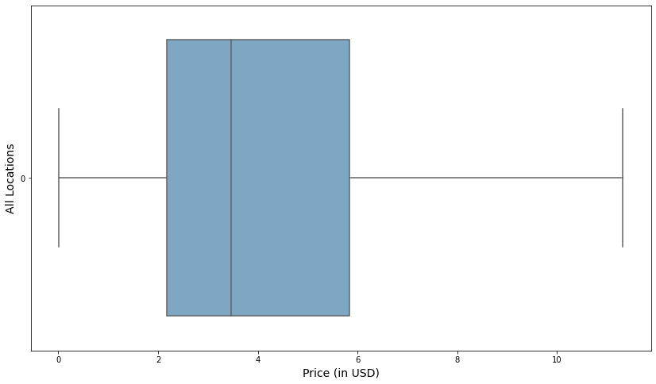
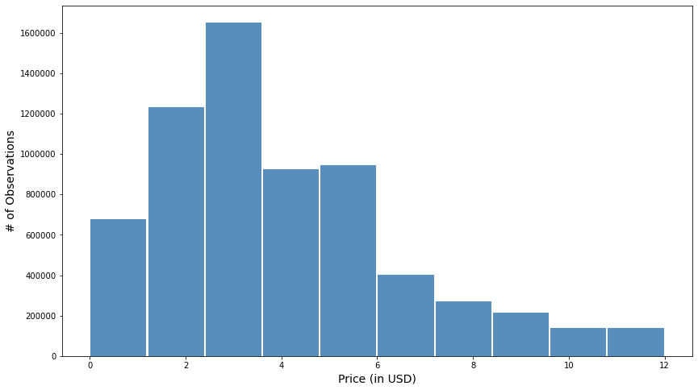
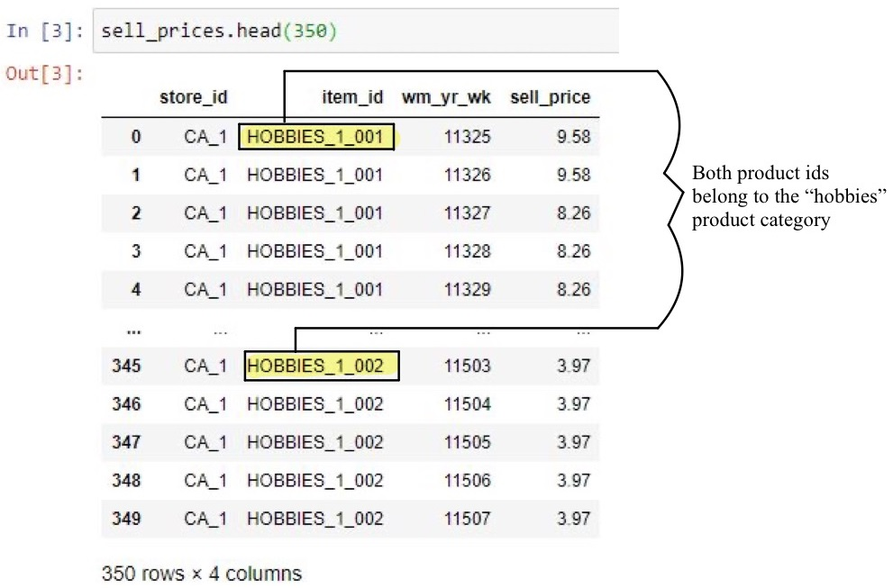

## <u> **Business Understanding** </u>

### **Background**

Walmart is the world’s largest company by a 12-month trailing revenue of $542.0 billion (Reiff, 2021). With so much annual revenue at stake, it is of paramount importance to predict price in terms of both accuracy and precision. A prediction not rooted in the balanced approach of forecasting sales visa vie historical data can have severe consequences for this retailer and its shareholders. The optimal price will be equal to the marginal cost for every unit sold. This will be the point where profit is maximized. Though a certain percentage of customers may be lost from an increase in prices, it is important to consider an optimal pricing strategy where customers are retained, and the overall sales trajectory will be one that is positive in the long run.

Using the labor hours of pricing analysts to sift and filter through the data, actionable insights will be derived. Building an automated supervised learning model rooted in a sound and proper exploratory data analysis will stand to benefit the stakeholders of the organization.

### **Business objectives and success criteria**

It is our goal to forecast daily sales with the greatest degree of accuracy for an entire month as a proxy for the remaining eleven months of the year. We will take the imported flat file as a basis for our growth model (a jumping off point). We are looking to adopt a high margin pricing strategy whereby prices and costs are monitored such that prices are adjusted with costs once they break even. From there forward, price adjustments will be commensurate with economic factors. For example, in the event of a downturn, “lowering prices can result in a profit margin that is lower but creates an increase in sales” (Morgan, n.d.). Establishing these trends now (in the first quarter) helps the organization uncover any missteps in pricing that can be course corrected earlier rather than later, thereby saving time and money.

For example, uncovering skewness in any one product category will undoubtedly create a disequilibrium in price, thereby promoting a similar disequilibrium in sales. Keeping the overhead of marketing and advertising costs at lower levels will undoubtedly create progressively thinner cost margins per unit sold; but selling the products at economies of scale using the economy pricing strategy will cast a wider net of customers in the long run. This will contribute to higher total sales volume over the course of the fiscal year.

It is exactly here that we must remember the great Sam Walton who founded this enterprise “to keep operations costs low. Walton himself famously drove around in an old pickup truck long after he was a multimillionaire; in our era, the store keeps costs low by using a sophisticated and largely automated supply-chain management system, by keeping in-store design basic, by having executives use budget travel options, and, until recently, by paying hourly employees less than competitors” (John, 2019).

Therefore, a balanced approach must be taken throughout this endeavor. While profit maximization is virtually every enterprise’s dream, maintaining a strict top line of revenue at expectations (at least) is the safest sustainable practice for this business. This is what places us ahead of our competition year-over-year. That being said, once these expectations of sustainability are met at a minimum, we can focus on growth as a target within reach.

Here is the bottom line. Pricing the products above cost, but low enough for the average middle-class consumer to afford and getting this right in the first quarter will boost revenue and maximize profits long-term. However, for this to work effectively and efficiently, we must have a detailed review of the pricing strategy by our analysts for the first quarter and make recommendations from findings for the remaining months in the year.

An effective, consistent, and sensible pricing strategy must be always maintained for an upward trending sales trajectory into the second, third, and fourth quarters.

### **Inventory of resources**

The following list of tangible and intangible resources is provided to ensure a smooth and proper undertaking of this project:

Intangible Assets (Resources) – Personnel:

1. Data Analysts - (a team of two):
2. Data Scientist – to oversee the successful completion of this project
3. IT staff member – to oversee software, hardware, and internet connectivity issues as they arise.
4. Legal and compliance team – to review business project contract
5. Accounting – for expense tracking and invoices
6. Project Manager 

Tangible Assets (Resources)

1. Data: Kaggle datasets – a separate one for raw sales data, one with seasonality trends, and one to test and train the predictive model. The data is uploaded on the shared M: drive and backed up on the company’s Google cloud (i.e., log into company account through google, and access the following link: drive.google.com).
2. Software: Microsoft Excel – to handle the raw examination of the .csv file (as backup).
3. Software: Anaconda Navigator installed and equipped with Jupyter Notebooks to load in the .csv file for analysis.
4. Software: Windows 10 running on a PC with at least 16 gigabytes of ram.
5. Zendesk: to log IT related support issues should they arise.

### **Requirements, assumptions, and constraints**

This project begins if and only if the full scope of its requirements, assumptions, and constraints are fully understood, written, and signed by all parties involved. First and foremost, to ensure compliance is met with the proper due diligence that it deserves, all parties must resolve to indemnify and hold others harmless for any resulting inefficiencies resulting in the commencement and subsequent culmination of this endeavor. Contextual examples are provided from this section forward. An inefficiency may disguise itself merely as a constraint, and even progress to an inherent level of risk. The former is examined herein. Signing off on this section serves as written acknowledgement of these terms and conditions.

The explicit intent, purpose, and effect of this project is to ensure comprehensibility and digestibility across many vast user profiles with a basic business vocabulary. To this end, the full scale of this endeavor will inclusively and holistically involve staff members from each department mentioned in the inventory of resources. However, to narrow the focus of the final product, understanding trends and patterns should not be a complex undertaking that only people well-versed in the language of data analytics need understand. For this reason, the resulting price models will be relegated to high-level graphs and charts that show overall trends. Currency will be measured in U.S. dollars, while all narratives will be provided in the English language. Furthermore, the ensuing price models will be evaluated iteratively, until deployment is finalized, at which point the VP of Marketing and the Chief Financial Officer will work on ensuring repeatability and implementation (setting the optimal price) using the template built on Tableau Desktop.

In so doing, it is our goal to provide a comprehensive, yet comprehensible product. Whereas a substantial portion of foreseeable time will be allocated to “cleaning the data,” a similar and/or greater amount of time will be spent on relaying this information into an easily digestible format (i.e., PowerPoint presentation, Tableau dashboard). The end users mentioned above will be provided two versions of the final product via .csv flat file, and .json to import into the Tableau dashboard for subsequent renditions of the price model, ensuring scalability. A data connector from the .json format to the Tableau server will be created to show live updates. The flat .csv file shows the original price model at the initial deployment stage (a jumping off point).

Data-warehousing should not be disregarded. We are well aware of the necessity for a securely maintained database due to the sensitive and proprietary nature of company information at this magnitude. All end users will be provided with two-factor authentication to ensure an extra layer of protection, not limited to usernames and passwords. Sharing of any information (e.g., emails, graphs, and charts) from this project is strictly prohibited by law outside of the organization’s immediate framework, and strictly limited to Google Cloud, company email only and during normal working and/or consulting working hours to staff members onsite. Onsite staff members are those scheduled to perform essential tasks for this project only, with billable hours submitted to the accounting team at the end of each working week. For further information, please contact human resources and the legal/ compliance team.

For this reason, it is important to consider the following schedule, aligning with the business’s expectations on milestones, hard deadlines, and corresponding remarks.

<table class="tg">
  <tr>
<thead>
  <tr>
    <th class="tg-9roo">Week #</th>
    <th class="tg-rsm2">Phase</th>
    <th class="tg-rsm2">Expected Outcome</th>
  </tr>
</thead>
<tbody>
  <tr>
    <td class="tg-9roo">Week 1</td>
    <td class="tg-6khm">Business Understanding</td>
    <td class="tg-hsln">Price Model White Paper</td>
  </tr>
  <tr>
    <td class="tg-9roo">Week 2</td>
    <td class="tg-6khm">Data Understanding</td>
    <td class="tg-hsln">Consult with IT and build dashboard</td>
  </tr>
  <tr>
    <td class="tg-9roo">Week 3</td>
    <td class="tg-6khm">Data Preparation</td>
    <td class="tg-hsln">Build MySQL database</td>
  </tr>
  <tr>
    <td class="tg-9roo">Week 4</td>
    <td class="tg-6khm">Data Understanding</td>
    <td class="tg-hsln">Test and deploy Storyboard</td>
  </tr>
  <tr>
    <td class="tg-9roo">Week 5</td>
    <td class="tg-6khm">Modeling</td>
    <td class="tg-hsln">Build Price Model</td>
  </tr>
  <tr>
    <td class="tg-9roo">Week 6</td>
    <td class="tg-6khm">Evaluation</td>
    <td class="tg-hsln">Evaluate Price Model</td>
  </tr>
  <tr>
    <td class="tg-9roo">Week 7</td>
    <td class="tg-6khm">Deployment</td>
    <td class="tg-hsln">Deploy Price Model</td>
  </tr>
</tbody>
</table>

Prior to dispensing with the remarks by way of constraints on the schedule above, it is necessary to provide a commentary on the following assumptions:

* Walmart as a publicly traded company provides detailed annual financial statements not limited to statement of cash flow, income statement, and balance sheet pro forma.
* The data is rooted in a one-to-one type of cardinality where one element of a column (variable) shares an element in another
* The data is extractable with relative ease, once provided access to the necessary infrastructure(s)
* Suppliers across all product categories will not increase their prices

While the metrics of Walmart’s current pricing strategy and impact on annual revenue can be studied with relative ease during the first week, a draft of the risks, contingencies and terminology needs to accompany all elements of the business’s understanding during this first phase. This will inevitably bleed over into week two. Moreover, a refined economic model that accounts for first and second order conditions based on derivative calculus lends itself to a series of its own constraints (real and theoretical alike). For example, “the presence of increasing returns to scale is in most cases incompatible with the competitive behaviour of firms (i.e., profit maximization at given prices)” (Villar, 1996). Furthermore, there exists the actual constraint of availability of resources, especially when researching the last five years’ revenue metrics year over year, and month over month to identify sales trends.

Prior to embarking on the second phase, a coordinated effort between the analytics team and IT may yield its own set of challenges not limited to conversations around data infrastructure, and/or the act of coordination itself. Aligning everyone’s schedules and expectations at this stage is critical for the ultimate success of the project, yet a constraint in its own right. IT is the gatekeeper on availability of resources, and their lack of coordinated delivery on untethered access to Tableau Desktop, Jupyter Notebooks, and MySQL server is a constriction on the analytics team’s ability to provide their share of deliverables in a timely manner. This, in conjunction with the need to spend at least four additional days exploratory data analysis and dashboard design necessitates an extended timeframe on data understanding.

Moreover, data will be gathered, assessed, and pre-processed on a sequential time horizon, starting with the first .csv flat file to the next point of origin – Jupyter Notebook, and to the next flat file, and so on and so forth. However, as with any data gathering process, unexpected roadblocks abound. Though we may expect to start with one flat file from the project timeline first, further discussion with the analytics team may result in a subsequent decision to ingest another flat file into the framework for exploratory data analysis or pieces of multiple files at a time. Expectations in data integrity may result in an invariable time constraint, thereby pushing this portion of the project out at least another week.

The following constraints must be resolved for a feasible price model to hold any merit:

* Decisiveness over modeling techniques (linear or logistic regression)
* Type I (false positive) and Type II (false negative errors) lending themselves to decreasing statistical significance, or increasing sample size
* Settling on sampling methodology (i.e., stratified random sample, simple random sample, or sample of convenience).

More importantly, we must not ignore the following legal constraints. Pursuant to the U.S. Retail Pricing Laws and Regulations, California, Wisconsin, and Texas have their own unique regulations:

* In the state of California, “no person, firm, corporation, or association shall advertise, solicit, or represent by any means, a product for sale or purchase if it is intended to entice a consumer into a transaction different from that originally represented” (U.S. Retail Pricing Laws and Regulations, 2020).
* In the state of Wisconsin, “inspections of price verification systems shall comply with
section 7 ‘test procedures’ from the chapter titled ‘examination procedure for price verification,’ national institute of standards and technology handbook 130 (uniform laws and regulation in the areas of legal metrology and engine fuel quality), 2006 edition” (U.S. Retail Pricing Laws and Regulations, 2020).

From an ethical standpoint, the modus operandi for price optimization must be constrained in the following ways:

* There must exist no tacit understandings between Walmart, its subsidiaries, or competitors with respect to price fixing. To this end, the “The Sherman Act outlaws ‘every contract, combination, or conspiracy in restraint of trade,’ and any ‘monopolization, attempted monopolization, or conspiracy or combination to monopolize’” (Federal Trade Commission, 2021).
* Without proper testing and training, the algorithm itself - left to its own devices, may outprice other competitors beyond a reasonable measure. For example, since Walmart has more than one product category, necessary household items (sanitizers, and other valuables for combatting COVID-19) may become inaccessible to its buyers

Lastly, there are the obvious technological limitations of insufficient processing speed hampering performance on inadvertently overfitted dataset. While it is easy to get carried away with the minutia of extracting information from a purely technical standpoint, the extraction itself must be met with a sobering reality. A slower processing speed (inefficiency), though sometimes unforeseen, should not compromise data integrity.

### **Risks and contingencies**

With any business endeavor there exists a certain amount of risk as it pertains to the resources of money, human capital, and labor hours.
Billable hours themselves are inherent trade-offs with allocatable time. One additional hour spent on working this project may be allocated to other worthwhile endeavors or sacrificed by virtue of opportunity cost to another project within the organization. However, an opportunity cost need not equate to an opportunity lost. More importantly, the following scenarios could delay or even derail the successful completion of this project, but each is met with a respective contingency plan to mitigate potential loss.

Billable hours themselves are inherent trade-offs with allocatable time. One additional hour spent on working this project may be allocated to other worthwhile endeavors or sacrificed by virtue of opportunity cost to another project within the organization. However, an opportunity cost need not equate to an opportunity lost. More importantly, the following scenarios could delay or even derail the successful completion of this project, but each is met with a respective contingency plan to mitigate potential loss.

<table class="tg">
  <tr>
<thead>
  <tr>
    <th class="tg-6v43">Risk</th>
    <th class="tg-6v43">Contingency Plan</th>
  </tr>
</thead>
<tbody>
  <tr>
    <td class="tg-ycr8">• Unexpected system outages (i.e., internet connectivity)</td>
    <td class="tg-ycr8">In the rare and unlikely event of an internet outage, especially when working from a home office, it is crucial to coordinate with IT the procurement of mobile wireless hotspots. The Verizon MiFi M2100 5G UW is one such option (Verizon, n.d.). IT will oversee and monitor any issues pertaining to gateway security, and privacy, but this must be assured due to the sensitive nature of this project. Zendesk support tickets will be used to log IT related issues.</td>
  </tr>
  <tr>
    <td class="tg-ycr8">• Security risks (i.e., privacy, data integrity)</td>
    <td class="tg-ycr8">In the event of a data breach or leak of information, all parties must be made aware of the following policies and procedures. Due to the sensitive nature of information exchanged via the internet, especially from remote work-from-home locations, all parties must make written acknowledgements and/or affidavits to adhere to the strictest privacy disclaimers. The legal and compliance team (as mentioned in the inventory of resources) will draft and review such paperwork ensuring structural integrity, upholding all parties to the highest legal and ethical standards.</td>
  </tr>
  <tr>
    <td class="tg-ycr8">• Staffing resources unavailable (i.e., temporary or permanent reduction in staff hours dedicated to this project)</td>
    <td class="tg-ycr8">With any project, a dedicated staff may experience untimely and unforeseen emergencies leading to a reduction in hours. For this reason, we have a team of two data analysts – one to oversee the other in a senior capacity. Both will be kept apprised of each other’s files and records via shared drive on Google cloud. They will keep a running log of all steps completed in the project and maintain each as a running Google document (saved automatically to the cloud). Both will be cross trained in each other’s daily routines and handling of tasks in the event of absence by one or the other. Especially now with the pandemic, untimely absenteeism needs to be taken with a grain of salt. There is a human element in all of this, so we must take great care and precaution to understand that things happen, but this is where this contingency plan comes into play.</td>
  </tr>
  <tr>
    <td class="tg-ycr8">• Limited productivity due to distributed teams. Staff deliverables between analysts and data scientists may not be met or produced in a timely manner.</td>
    <td class="tg-ycr8">To maximize workflow efficiency, proper communication channels will be established from the onset. For example, the team will utilize Microsoft Teams in lieu of face-to-face meetings, where such communications and collaboration will be facilitated by the project manager.  Senior leadership from each team will ensure smooth and timely deliverables via set up of Google calendar complete with invites for all meetings and weekly goals, starting with the kick-off call.  All scheduled meetings will take place in the agreed upon time zone of PST. </td>
  </tr>
</tbody>
</table>

### **Terminology**

**Anaconda Navigator:** “a desktop GUI that comes with Anaconda Individual Edition. It makes it easy to launch applications and manage packages and environments without using command-line commands” (Anaconda, 2021).

**Confidence Level:** “the probability that a population parameter will fall between a set of values for a certain proportion of times. Confidence intervals measure the degree of uncertainty or certainty in a sampling method. They can take any number of probability limits, with the most common being a 95% or 99% confidence level” (Hayes, 2020).

**Data Analytics:** “the science of analyzing raw data in order to make conclusions about that information. Many of the techniques and processes of data analytics have been automated into mechanical processes and algorithms that work over raw data for human consumption” (Frankfield, 2020).

**Disequilibrium:** “a situation where internal and/or external forces prevent market equilibrium from being reached or cause the market to fall out of balance. This can be a short-term byproduct of a change in variable factors or a result of long-term structural imbalances” (Chen, 2020).

**Economies of Scale:** “cost advantages reaped by companies when production becomes efficient” (Kenton, 2021).

**Exploratory Data Analysis:** initial way of looking at the data

**Hypothesis Test:** “an act in statistics whereby an analyst tests an assumption regarding a population parameter. The methodology employed by the analyst depends on the nature of the data used and the reason for the analysis” (Majaski, 2020).

**Independent Variable:** x variable (predictor) or “the parameter that is used to calculate the dependent variable or outcome” (Kenton, 2021).

**Jupyter Notebook:**  “an open-source web application that allows you to create and share documents that contain live code, equations, visualizations and narrative text. Uses include: data cleaning and transformation, numerical simulation, statistical modeling, data visualization, machine learning, and much more” (Project Jupyter, 2021).

**Linear Regression:** “regression is a statistical method used in finance, investing, and other disciplines that attempts to determine the strength and character of the relationship between one dependent variable (usually denoted by Y) and a series of other variables (known as independent variables)” (Beers, 2020).

**Predictive Analytics:** “predictive analytics is a category of data analytics aimed at making predictions about future outcomes based on historical data and analytics techniques such as statistical modeling and machine learning” (Edwards, 2019).

**Revenue:** “the income generated from normal business operations and includes discounts and deductions for returned merchandise. It is the top line or gross income figure from which costs are subtracted to determine net income” (Kenton, 2020).

**Skewness:** a distortion of symmetry deviating from the normal distribution of data (Chen, 2021).

**Statistical Significance:** “a determination by an analyst that the results in the data are not explainable by chance alone” (Kenton, 2020).

### **Data mining goals and success criteria**

To enact an effective pricing strategy, a strong inverse (negative) linear correlation between price per unit and sales volume must be established. This can be accomplished within the scope and context of a supervised linear regression model. However, we are examining itemized transactions, not total sales to measure price movements. Therefore, forcing a dataset to behave a certain way cannot be recommended in good faith for various reasons, ethical considerations among them. Price optimization and profit maximization need not be mutually exclusive. The following three steps summarize the analytical approach:

1. We begin with a vector of all zeroes for each product’s sales price (Srivastava, 2016).
2. Each product’s sales price is subsequently increased or decreased by a percentage value to measure the effect on total profit (Srivastava, 2016).
3. Sales resulting in an increased profit is kept to “find further marginal increment” (Srivastava, 2016).

Thus, we will run several hypothesis tests to establish a solid foundation for the model in its earlier stages. The initial exploratory data analysis process will determine and unveil the independent (predictor) variables, distinguishing them from the dependent (response) variable of what we are trying to predict (price). This will involve making an initial claim (null hypothesis) about price movements going up or down. A sample of 100 observations will be taken to measure this claim.

Statistical significance from this sample size will be established under a confidence level of 95%. If the result yields in favor of statistical significance, we can conclude that the results have occurred due to chance, and not any kind of pre-processing or manipulation of the model. Rejecting or failing to reject our initial claim hinges on this framework. Testing the model in and of itself is a goal, attribution, and testament to a successful analytics endeavor.

Realizing that our challenge may extend beyond a traditional linear regression model, we are prepared to explore alternative logistical models, which we will discuss in greater detail.

### **Project plan and order of tasks**

<iframe src="https://docs.google.com/spreadsheets/d/e/2PACX-1vTe1cKlC2-msTnvOtSJrZQKZkQHnnmzvl2ZqVbdCalpDp8Wio5yr07Nk6jHbP8iT3qExeY9qKmW7lK9/pubhtml/sheet?headers=false&amp;gid=0&amp;range=A1:BC33" width="98%" height="1745"></iframe>

## <u>**Data Understanding**</u>

Initial data collection report
The following datasets were acquired exclusively from Kaggle on the data tab at the top of the page (Kaggle, 2020). They are listed below and found in the following master directory:
C:\Users\lshpaner\OneDrive\University of San Diego\MS Applied Data Science\ADS-501 - Foundations of Data Science and Data Ethics\Datasets

* calendar.csv
* sales_train_validation.csv
* sell_prices.csv

Opening the “sell_prices.csv” file in Microsoft Excel yields a discovery of 1,048,576 unfiltered line items. This happens to be the maximum observable rows for this piece of software.

In looking at the sell prices file through Excel, observations for only two store locations in the state of California are presented, even though Walmart has an extensive variety of locations across the United States. While the entire population or a representative sample for this dataset cannot be acquired or used, a smaller sample size will suffice.

Moreover, this flat .csv file “contains information about the price of the products sold per store and date” (Kaggle, 2020). Further inspection using a software that can handle the full size and scope of the data is warranted. The sell_prices.csv file is loaded into Jupyter Notebook, uncovering the exact shape of this dataset at 6,841,121 rows by 3 columns:

print(sell_prices.shape)  
(6841121, 4)  

An itemized breakdown of foods, hobbies, and various household items sold is enumerated by price point to create a basis point of reference in the undertaking of the predictive analytics process.

Calendar dates (calendar.csv) for this sales data is provided to examine seasonality.

### **Data description report**

**File 1: “sell_prices.csv”**

It appears at first glance that only information for stores in California are available by accessing this file from Excel (where only two types of observations (CA_1 and CA_2) exist. This is a false premise to conclude. We will need to examine this dataset from Anaconda’s Jupyter Notebooks. Here, by loading in the necessary packages (i.e., import pandas as pd) and dataset appropriately (sell_prices = pd.read_csv ('sell_prices.csv'), we can take a glance at the last five line items of the dataset with the code sell_prices.tail(). This uncovers that there are some stores in the state of Wisconsin. Our initial data collection report confirms store locations not only in California, but Texas, and Wisconsin, so we are now able to see a more complete picture.

Table 1 confirms via output from a Jupyter Notebook that other locations not accessible via Microsoft Excel by accessing the dataset using the pandas package with python.

Moreover, the file contains the following four variables (columns) “about the price of the products sold per store and date” (Kaggle, 2020).

**Table 1**

<table class="tg">
  <tr>
<thead>
  <tr>
    <th class="tg-0lso">store_id</th>
    <th class="tg-o5v9">“The id of the store where the product is sold” (Kaggle, 2020).</th>
  </tr>
</thead>
<tbody>
  <tr>
    <td class="tg-1dmi">item_id</td>
    <td class="tg-o5v9">“The id of the product” (Kaggle, 2020).</td>
  </tr>
  <tr>
    <td class="tg-1dmi">wm_yr_wk</td>
    <td class="tg-o5v9">“The id of the week” (Kaggle, 2020).</td>
  </tr>
  <tr>
    <td class="tg-1dmi">sell_price</td>
    <td class="tg-o5v9">“The price of the product for the given week/store. The price is provided per week (average across seven days). If not available, this means that the product was not sold during the examined week. Note that although prices are constant at weekly basis, they may change through time (both training and test set)” (Kaggle, 2020).</td>
  </tr>
</tbody>
</table>

**File 2: “calendar.csv”**

Table 2 “contains information about the dates the products are sold” (Kaggle, 2020).

**Table 2**

<table class="tg" style="undefined;table-layout: auto; width: 100%">
<colgroup>
<col style="width: 78px">
<col style="width: 436px">
</colgroup>
  <tr>
<thead>
  <tr>
    <th class="tg-0nwr">date</th>
    <th class="tg-vwfw">“The date in a “y-m-d” format” (Kaggle, 2020).</th>
  </tr>
</thead>
<tbody>
  <tr>
    <td class="tg-0nwr">wm_yr_wk</td>
    <td class="tg-vwfw">“The id of the week the date belongs to” (Kaggle, 2020).</td>
  </tr>
  <tr>
    <td class="tg-0nwr">weekday</td>
    <td class="tg-vwfw">“The type of the day (Saturday, Sunday, …, Friday)” (Kaggle, 2020).</td>
  </tr>
  <tr>
    <td class="tg-0nwr">wday</td>
    <td class="tg-vwfw">“The id of the weekday, starting from Saturday” (Kaggle, 2020).</td>
  </tr>
  <tr>
    <td class="tg-0nwr">month</td>
    <td class="tg-vwfw">“The month of the date” (Kaggle, 2020).</td>
  </tr>
  <tr>
    <td class="tg-0nwr">year</td>
    <td class="tg-vwfw">“The year of the date” (Kaggle, 2020). </td>
  </tr>
</tbody>
</table>

### **Data exploration report**

Exploratory data analysis will shed some light on these datasets, providing valuable metrics not limited to summary statistics and distribution. Figure 1 shows the distribution of sales prices across all territories. Whereas, the presence of outliers does not affect the median price, it does somewhat skew the data, in this case showing the average sales price to be $4.41. For this reason, we are interested in data that is resistant to outliers, since its large scale and size has a propensity to distort our findings from the ensuing analysis. Therefore, examining the distribution of sell_prices.csv, without outliers reveals the following boxplot:

**Figure 1**

*Boxplot Price Distribution of Walmart Items*

*Note. This distribution in this dataset is positive skewed, where the mean price of $3.91 is higher than the median price of $3.24.*

The summary statistics breakdown in Table 3 sheds further light on the distribution of the data from a strictly numerical standpoint. The average price of $3.91 across all territories and product items, does indeed come closer to reasonable results.

**Table 3**

*Price Distribution of Walmart Items*

<table class="tg">
  <tr>
<thead>
  <tr>
    <th class="tg-ycr8"></th>
    <th class="tg-6v43">Mean</th>
    <th class="tg-6v43">Standard Deviation</th>
    <th class="tg-6v43">Mode</th>
    <th class="tg-6v43">Minimum</th>
    <th class="tg-6v43">Q1</th>
    <th class="tg-6v43">Median</th>
    <th class="tg-6v43">Q3</th>
    <th class="tg-6v43">Maximum</th>
  </tr>
</thead>
<tbody>
  <tr>
    <td class="tg-6v43">Price</td>
    <td class="tg-i81m">$3.91</td>
    <td class="tg-i81m">$2.40</td>
    <td class="tg-i81m">$2.98</td>
    <td class="tg-i81m">$0.01</td>
    <td class="tg-i81m">$2.00</td>
    <td class="tg-i81m">$3.24</td>
    <td class="tg-i81m">$5.27</td>
    <td class="tg-i81m">$11.32</td>
  </tr>
</tbody>
</table>

Understanding the patterns and behaviors of prices is the first step in building out an adequate price model. The most repeated price in this dataset (mode) is $2.98, which falls in the middle between the mean and median.

A subsequent histogram in Figure 2 confirms these findings. Rather than exhibiting a normal distribution, there is a positive skew in pricing.

**Figure 2**

*Histogram Price Distribution of Walmart Items*

*Note. The histogram confirms and exhibit a positive skewness, typically seen in a Poisson distribution, rather than a normal one. Moreover, there are over sixteen million observations between the $2 and $4 price points, leaning in favor of an optimal price within that range.*

### **Data quality report**

For the purposes of an initial exploratory data analysis, the sell_prices.csv dataset provides a visual and numerical demonstration of prices across all product categories, independent of store location. During the pre-processing stage, outliers are inspected and the average price pertaining thereto equals $15.19, with an original average price of $4.41 – an alarming $10.78 difference. Subsequently removing these outliers strengthens data integrity by setting a more robust foundation for a sensible price model to build, draw inference, and actionable insights from.

However, upon further examination, Figure 3 exhibits that each respective item category (i.e., hobbies, foods, and household items) is assigned its own unique identification number. In Excel, a simple text to columns can parse out these identification numbers by a common tab delimiter, thereby only attributing the categorical names to this item variable. However, doing so within the framework of Python proves challenging. Similarly, for each store location (California, Wisconsin, and Texas) there are unique identifications that will require parsing out the numeric values from the alphanumeric characters. Separating the store locations and product categories from their respective identification numbers will subsequently promote the next stage of data analysis. This includes but is not limited to identifying variable relationships through correlation, scatter plots, and eventually supervised learning via linear and logistic regression.

*Note. An item_id can have more than one identification number, but still belong in the same product category.*

Furthermore, the numerical values attributed to the column “wm_yr_wk” are only identification numbers, not actual calendar dates. This is where the calendar.csv file bridges the gap, by addressing the challenges pertaining to matching and indexing data. Once again, whereas in Excel, a simple VLOOKUP formula would suffice in matching this data between two worksheets, a rendition of this in Jupyter Notebooks may prove to be quite challenging, but not impossible.

In terms of data integrity, there are no missing values and the data itself is complete, thereby negating the need for smoothing the data in the pre-processing stage. However, one of the main limitations is the need for separate datasets, rather than having a clean one-stop-shop flat file for analysis. Therefore, the physical act of merging one dataset to another within the context of the chosen data analysis tool, Python, may prove strenuous in the short run, but feasible, and rewarding in the long run. This endeavor will ultimately yield actionable insights prescribed in the previous sections of this paper.

### **References**

Anaconda. (2021). *User interface makes learning easier.* <ol> https://doi.org/10.1080/14036096.2011.599174 </ol>

Beers, B. (2020, February, 19). Regression Definition. *Investopedia.*<ol>
https://www.opendoor.com/w/blog/why-days-on-market-matter </ol>

Chapman, P., Clinton, J., Kerber, R., Khabaza, T., Reinartz, T., Shearer, C., & Wirth, R. (2000). *CRISP-DM 1.0 Step-by-step data mining guide.* <ol> Predictive Analytics & Machine Learning Global Services in Training, Consulting and Enablement by TMA, LLC. https://the-modeling-agency.com/crisp-dm.pdf </ol>
 
Chen, J. (2020, November 28). Disequilibrium. *Investopedia.* <ol> https://www.investopedia.com/terms/d/disequilibrium.asp </ol>

Chen, J. (2021, January 25). Skewness. *Investopedia.* <ol> https://www.investopedia.com/terms/s/skewness.asp </ol>

Edwards, J. (2019, August 16). What is predictive analytics? Transforming data into future
insights. *CIO.* <ol> https://www.cio.com/article/3273114/what-is-predictive-analytics-transforming-data-into-future-insights.html </ol>

Federal Trade Commission. Retrieved February 22, 2021, from <ol> https://www.ftc.gov/tips-advice/competition-guidance/guide-antitrust-laws/antitrust-laws </ol>

Frankfield, J. (2020, July 1). Data Analytics. *Investopedia.* <ol> https://www.investopedia.com/terms/d/data-analytics.asp </ol>

Hayes, A. (2020, October 8). Confidence Interval. *Investopedia.* <ol> https://www.investopedia.com/terms/c/confidenceinterval.asp </ol>

John, S. (2019, April 8). How Walmart keeps its prices so low. *Business Insider.* <ol> https://www.businessinsider.com/walmart-low-price-strategy-tips-2019-4 </ol>

Kaggle. (2020). *M5 Forecasting – Accuracy.* Kaggle: Your Machine Learning and Data Science Community. January 18, 2021. <ol>https://www.kaggle.com/c/tweet-sentiment-extraction/overview </ol>

Kaggle. (2020). *M5 Forecasting – Accuracy.* Kaggle: Your Machine Learning and Data Science Community. January 18, 2021. <ol> https://www.kaggle.com/c/m5-forecasting-accuracy/data </ol>

Kenton, W. (2021, January 15). Economies of Scale. *Investopedia.* <ol> https://www.investopedia.com/terms/e/economiesofscale.asp </ol>

Kenton, W. (2021, January 24). Multiple Linear Regression (MLR). *Investopedia.* <ol> https://www.investopedia.com/terms/m/mlr.asp </ol>

Kenton, W. (2020, October 1). Revenue. *Investopedia.*  <ol> https://www.investopedia.com/terms/r/revenue.asp </ol> 

Kenton, W. (2020, October 24). Statistical Significance. *Investopedia.* <ol> https://www.investopedia.com/terms/s/statistically_significant.asp </ol>

Majaski, C. (2020, October 24). Hypothesis Testing. *Investopedia.* <ol> https://www.investopedia.com/terms/h/hypothesistesting.asp </ol>

Morgan, R. (n.d.). Highest Proft Margin Strategies. *Chron.* <ol> https://smallbusiness.chron.com/highest-profit-margin-strategies-13951.html </ol>

Project Jupyter. (2021, January 6). *The Jupyter Notebook.* <ol> https://jupyter.org/ </ol>

Reiff, N. (2021, January 18). WMT, SNP, and AMZN top the list of the 10 biggest companies in
the world. *Investopedia.* <ol> https://www.investopedia.com/articles/active-trading/111115/why-all-worlds-top-10-companies-are-american.asp </ol>

Srivastava, T. (2016, July 4). Solving Case study : Optimize the Products Price for an Online
Vendor (Level : Hard). *Analytics Vidhya.* <ol> https://www.analyticsvidhya.com/blog/2016/07/solving-case-study-optimize-products-price-online-vendor-level-hard/ </ol>

U.S. Retail Pricing Laws and Regulations, California. Stat. § 12024.6. (2020). <ol> https://www.nist.gov/system/files/documents/2017/05/09/CALIFORNIA-2015.pdf </ol>

U.S. Retail Pricing Laws and Regulations, Wisconsin. Stat. § 92.06 (2020). <ol> https://www.nist.gov/system/files/documents/2017/04/28/WISCONSIN.pdf </ol>

Verizon. (n.d.). Business Hotspot Devices. <ol> https://www.verizon.com/business/products/devices/mobile-hotspots/inseego-mifi-m2100-5g-uw </ol>

Villar, A. (1996). Constrained Profit Maximization. In: General Equilibrium with Increasing
Returns. *Lecture Notes in Economics and Mathematical Systems, 438.* <ol> https://doi.org/10.1007/978-3-662-00457-9_9 </ol>

